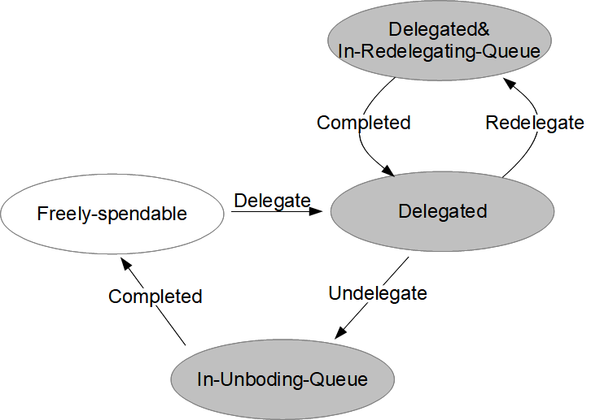
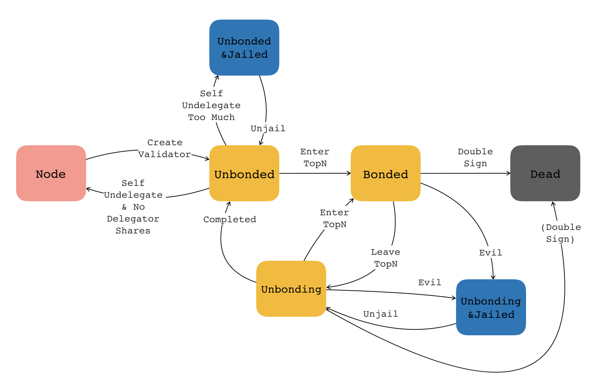

## Concepts

### Account Management

#### Account categories

There are two categories of accounts in CoinEx Chain: normal accounts and vesting accounts. Vesting accounts can only be created in the genesis block and the assets in it is locked for a predefined period. After the locking period, a vesting account can operate just like a normal account. 

The locked CET tokens of CoinEx team are contained in 5 locking accounts, whose unlocking dates are 2020/1/1, 2021/1/1, 2022/1/1, 2023/1/1 and 2024/1/1.

#### Account Address

Accounts are authenticated with the signing algorithm ECDSA defined over elliptic curve secp256k1, which is just the same as Bitcoin. Bitcoin's raw address is calculated as: `RIPEMD160(SHA256(compressed_33byte_public_key))`, and CoinEx Chain follows it.

There are multiple address formats developed in blockchain's history: P2PKH, P2SH and Bech32. CoinEx Chain adopts the Bech32 format, which is composed of three parts:

1. The human-readable prefix. For CoinEx Chain mainnet,  it is **coinex**, and for the testnet, it is **cettest**.
2. The separator, which is always "1".
3. The data part, which is at least 6 characters long and only consists of alphanumeric characters excluding "1", "b", "i" and "o". This part encodes the bytes of raw address and some checksum bits.

#### Aliases

Compared to bech32 addresses, alias is more user-friendly to indicate an account. So CoinEx Chain supports aliases to make wallets and explorers to present more readable information to users. A valid alias contains only `0~9` (digits), `a~z` (lower-case letters), `-`, `_`, `.` and `@`, while its length must be in the range of [2, 45]. Upper-case letters are not allowed. It's recommended to use email addresses as aliases.

One account can have at most `MaxAliasCount` aliases. Currently `MaxAliasCount` is 5, and can be changed through voting process. Among these aliases, you can pick one as default alias, or none as default alias.

Each alias corresponds to only one account. An account can remove its alias(es) such that the alias(es) can be used by other accounts.

Please note aliases are on-chain and with consensus, which is different from local names indicating private keys on your computer or mobile phone.

#### The "Memo-Required" Option

There is a "memo-required" option for every account. You can turn it on or off any time.

"Memo" is an optional string attached to every transaction in CoinEx Chain, explaining its intent. Centralized exchanges can utilize memo for deposit. That is, one exchange maintains only one address on CoinEx Chain and different customer uses different memo (usually her ID on this exchange) to indicate who is depositing coins.

When "memo-required" option of an account is turned on,  every transaction which sends coins to this account must have a memo string, or it will fail.

Usually centralized exchanges will turn on memo-required option, to prevent its customers from forgetting to write ID in memo.

#### Locked coins, frozen coins and delegated coins

Besides the freely-spendable coins, an account can also have locked coins, frozen coins and delegated coins.

When someone else send you some coins, she can mark these coins as "locked" before a given unlocking time. You own these coins but can not spend them until the unlocking time. 

When you create a order for trading on the DEX, the stock coins to be sold or the money coins to be paid will be frozen. If an order expires or is canceled before it is fully filled, the remaining unfilled frozen coins will be unfrozen.

If you want to take part in the staking economy of CoinEx Chain, you must delegated your CET coins to one or more validators.  Such coins are "delegated coins". You can get back these delegated coins by unbonding them.

### Transaction fees

#### Gas fee and Feature fee

To prevent DDoS attach, CoinEx Chain charges transaction fees, in which only CET is accepted. Transaction fees include two parts: the usual gas fee (like Ethereum) and feature fee. Gas is calculated according to the size of transaction and the signature count. Feature fee is an extra fee charged for some particular operations, for example, issuing a new asset, listing a new trading pair, creating an account and transferring tokens with a lock time. The matched orders are charged according to the dealt amount with a configurable rate, which also falls in the category of feature fees.

#### How are the fees charged

To improve transaction throughput,  CoinEx Chain takes an optimistic strategy when packing new blocks. Unlike Bitcoin and Ethereum, CoinEx Chain packing a transaction into the new block does not mean it can  execute successfully. Instead, it only means: 1) the transaction passes basic format checks; 2) the sender has enough CET to pay the gas fee of the transaction; 3) the signature of the sender is correct. When a transaction fail, it still charges gas fees from its sender. In other words, gas fee is charged no matter the transaction succeeds or not.

So, it is the sender's responsibility to ensure the transaction can successfully execute. If you transfer more coins than your owned coins or create orders for a non-existent trading pair, you will fail but still have to pay the gas fee.

A wallet vendor can use the `--check-tx-with-msg-handle` option to prevent customers' gas fees from being charged because of failing transaction. Please refer to [CIP0005](https://github.com/coinexchain/CIPs/blob/master/en/cip-0005.md) for more information.

Feature fee is different from gas fee, and it is charged only when the transaction succeeds.

### Asset Issuance and Management

#### Permissionless Issuance

Currently CoinEx Chain supports ERC20-like fungible tokens. Any one can issue her token. The token issuer is its owner, who owns the created tokens. The issuance is totally permissionless and without any approval flow. CoinEx.com, CoinEx foundation or the validators of CoinEx Chain are not aware of the token owners' identities or the token's usage.

A token's precision is fixed at 8 decimal digits.

On CoinEx Chain, an asset is denoted by a unique symbol, which is composed of 2-11 characters/numbers and cannot begin with a number. You can not issue a new asset whose symbol conflicts with an existing one.

Some popular symbols, such as BTC, ETH, EOS, are reserved for issuing pegged tokens in the future. And the symbols for legal tenders, such as USD, CNY, RMB, are forbidden to be used as token symbols because of possible malicious usage.

Since symbols are scarce resources, a certain amount of feature fee (according to the symbol's length) will be charged for issuing a new token.

#### Asset attributes

Some attributes can be added when issuing a token. They are:  

1. Mintable: token owner can mint new tokens.
2. Burnable: token owner can burn tokens which are owned by her.
3. Addresses can be blacklisted (Address-Forbiddable):  token owner can forbidden an address to use her token, i.e., put it in a blacklist. The affected token in a forbidden address cannot be transferred or used for exchange, while other unaffected tokens in the address can still be used freely. 
4. Token can be globally forbidden (Token-Forbiddable) with exceptions in a white list. The token owner can forbid the token on demand, which means transfer and exchange are fully disabled. During the forbidden period, the token owner can create a whitelist of addresses that can initiate transfer transactions but no exchange transactions. And during that period, the token owner’s operations on the token are unaffected.

With these attributes, stable coins and security tokens can be implemented.

The following table summaries the different capabilities of different kinds of account.

|                | Whitelist address& Token owners | Normal Addresses | Forbidden Addresses |
| -------------- | ------------------------------------ | ---------------- | ------------------- |
| Create Order   | ✖                                    | ✖                | ✖                   |
| Match Order    | ✖                                    | ✖                | ✖                   |
| Transfer Token | ✔                                    | ✖                | ✖                   |
| Receive Token  | ✔                                    | ✔                | ✔                   |

These attributes can be modified after issuance, under some conditions. Please refer to [CIP0003](https://github.com/coinexchain/CIPs/blob/master/en/cip-0003.md) for more detail.

#### Ownership Transfer

A token owner can transfer the ownership to a different account. The new owner will have the abilities to mint, burn, blacklist addresses and forbidden the token, if the corresponding attributes is "true". But the coins in the older token owner's account will not be transferred to the new token owner.

### Transfer Tokens

#### Create Accounts by transferring coins

An account is created when some other account sends coins to it and a fixed feature fee (currently 1 CET) is charged during the creation. When you send coins to a non-existent account, if there is no CET in the sent coins or the amount of CET is less than one, you will fail in creating a new account and the send transaction will also fail.

The feature fee for account creation prevents the abusement of on-chain resources.

#### Send Locked Coins

You can send locked coins into someone's account. In this transaction the unlocking time must be specified, which is a Unix timestamp. When the block header's timestamp is later than the locked coins' timestamp, the coins are unlocked automatically. 

Locked coins take extra on-chain storage, to prevent abusement, a fixed feature fee (currently 100 CET) is charged when sending locked coins.

Sending locked coins may fit in the following scenarios:

1.  After issuing a token, the token owner divide the tokens and send them to several address with different unlocking time, which enforces a promised unlocking schedule.
2. The investors divided the invested funds into several parts and specify the unlocking time for each part.
3. When incenting developers and participators in a token's ecosystem, the tokens are sent to them with a lock time, which encourages them to continue contributing to the ecosystem.

A special kind of "supervised send" transaction can send locked coins with a supervisor. This supervisor can decide where the coins go (to the receiver or back to the sender) before the unlock time.  

### Market Creation and Management

#### Create a market

Without any approval or voting process, a token owner can freely create new market, i.e., a trading pair between her token and another token, where her token and the other token are referred to as  "stock" token and "money" token, respectively. She can choose any token as the money token, without the permission from the money token's owner. But normally, only the tokens with plenty of liquidity, such as CET, pegged BTC and pegged USDT, are suitable to be used as money tokens. 

A market can only be created by its stock token's owner. You can not create a market if you only own the money token, or you own none of them.

To avoid the abuse of system resources and ensure the quality of the on-chain ecosystem, a certain amount of CET will be charged as feature fee for issuing token and creating new trading pairs.

For each market, a price precision must be specified, which is the upper limit for the price precision of the orders in it. The market's creater, i.e. the owner of its stock token, can change its precision at any time.

For each market, an order precision must be specified, which controlls the granularity of the stock's amount in each order.

#### Cancel a market

A market can be canceled (delisted) by its stoke token's owner.  The cancellation must take effect in some future time, instead of immediately. The cancellation time is specified as a Unix time stamp and must be long enough from now. The interval between now and the specified cancellation time has a lower bound, which is controlled by the `MarketMinExpiredTime` parameter.

The first block after UTC midnight is a special one.  In the whole day, it is the only block for canceling market and deleting the expired GTE orders, and no matching is performed in this block. So a market can only be canceled when 1) the specified cancellation time has been reached, and 2) it is the first block after UTC midnight.

When a market is canceled, all the unfilled orders will be deleted.

### Orders

 #### GTE and IOC orders

Users can submit new bid orders or ask orders to the order book, or cancel self-placed orders from the order book at any time. Good Till Expire (GTE) orders and Immediate Or Cancel (IOC) orders will be automatically deleted from the order book after expiration. The former expires at 00:00 UTC after the predefined life time; While the latter expires at the next block after entering the order book (i.e., there is only one chance to be matched).

A GTE order's free-of-charge lifetime is controlled by the parameter `gte_order_lifetime`. Its life time can be lengthened by paying more feature fee: `gte_order_feature_fee_by_blocks` for one more block. If it is canceled or fully filled before the end of life time, feature fees will be charged according to its real life time, instead of the specified life time when the order is created.

#### Price Precision

In a transaction which creates a new order, there are two parameters to present the price: `price` and `price_precision`,  and the real price is calculated as `price`/10`price_precision`. The price precision of an order should be no larger than the price precision of the market. Thus the market's owner can control the granularity of prices. 

#### Cancel an Order

An order has an ID, which contains tree parts: its sender's bech32 address,  separator '`-`' and a decimal sequence number. The order's owner can cancel it after creation, by specifying its order ID. After the cancellation, the unfilled amount will be unfrozen. 

#### Trading Fee

Trading fee is a kind of feature fee which is charged at a fixed ratio (currently 0.1% for both makers and takers) with respect to the total filled amount. It can only be paid in CET and the detailed algorithm to calculate it is described in [CIP0001](https://github.com/coinexchain/CIPs/blob/master/en/cip-0001.md).

Trading fee is frozen when the order is created, and it will be all charged when the order is fully filled. And if the order is not fully filled because of expiration or cancellation, the remaining fee will be unfrozen.

### Matching in Order Book

#### Batched Auction

For off-chain order matching, orders are always accepted by the server one by one and can be prioritized by the submission time. The most important difference for orders matched on chain is that orders are packaged in blocks and the orders within the same block cannot be prioritized by time. In order to ensure that the orders within the same block are treated equally, we adopt the method of “batched auction” for order matching. For all bid and ask orders that can possibly be filled, a single price for execution will be calculated. The principles are as follows:

1. Maximizing matched volume.

2. Minimizing remaining volume. If more than one price has the same executable volume, the price should be the one with the lowest remaining volume. The remaining volume is the unexecuted amount for all orders with executable price.

3. Market Pressure. If multiple prices satisfy 1 and 2, then identify where market pressure of the potential price exists. A positive remaining amount indicates bid side pressure and higher prices are preferred, while a negative remaining amount indicates ask side pressure and lower prices are preferred.

4. When both positive and negative remaining amounts exist, the latest execution price is the reference price, and the price closest to the reference price should be chosen.

 #### Priority in order matching

After the execution price is decided, the bid orders and ask orders which accept this price are sorted into two queues and get matched by repeating the following steps:

1. Pick the order from the head of the **bid** order queue, and match it against the orders in the **ask** order queue (from head to tail). Then remove the fully-filled orders from the queues.
2. Pick the order from the head of the **ask** order queue, and match it against the orders in the **bid** order queue (from head to tail). Then remove the fully-filled orders from the queues.

The order queues are sorted under such a priority:

1. The orders with better prices will come first. Lower prices in ask orders and higher prices in bid orders are better prices.
2. For orders with the same price, older orders which are packed on chain at smaller heights, will come first.
3. For orders with the same price and same height, those with smaller hash key will come first. A hash key is calculated as `sha256(concat(order_id, data_hash))`, where `data_hash` is the Merkle root of the transactions in current block.

### Bancor Market

Bancor markets are similiar to normal markets. You can sell stock to them and gain money, or buy stock from them by paying money.

Normal markets, which is based on order book, try to match sellers' intention and buyer's intention. If there are no buyers or sellers, there is no liquidity.

Bancor markets are different. A bancor market is a robot, who keeps some stocks and some money. There is a public algorithm which calculates the stock's price based on the remaining stock/money kept by this robot. Anyone who accepts this price can buy stock from this robot or sell stock to it. So there is always enough liquidity.

Only the a token's owner can create a bancor market with this token as its stock.

#### Create a Bancor Market

You can create a bancor market by specifying two states of it: the initial state and the final state.

At the initial state, there are only stock kept by the robot, and the price is the lowest. At the final state, there are only money kept by the robot, and the price is the highest. Given the initial stock amount, initial price, the final gained money amount and final price, you can create a bancor market. And when it is created, the initial amount of stock is transfer from your account to the robot.

The algorithm which calculates the stock's price at any middle state is uniquely decided by these four parameters. Please refer to [CIP0008](https://github.com/coinexchain/CIPs/blob/master/en/cip-0008.md) for detail.

#### Cancel a Bancor Market

When a bancor market is created, an earliest cancel time is specified. After this time, the stock's owner (and the bancor market's creator) can cancel the bancor market.

When a bancor market is canceled, the stock and money kept by the robot will be transferred the creator.

#### Trade in Bancor Markets

The trade between you and the robot takes effects immediately. There is no wait for matching because you must accept the algorithm-calculated price.

On a public blockchain, if someone trade with the robot before you and the kept stock's amount is changed, then the algorithm-calculated price will change too.

### Rebating to Referee

To encourage wallet vendors to develop secure and easy-to-use applications to help user interact with CoinEx Chain, normal markets and bancor markets support rebating.

Each account has a referee attribute, which is usually an address controlled by a wallet vendor. When this account trade in markets, a small portion of the feature fees are sent to this referee and the other are distributed to the validators.

The referee attribute can be changed only once in a predefined period (currently one month).

### Staking

#### Delegation

In CoinEx Chain, any owner of CET can delegate her CET tokens to a validator. Any node can become a validator if it delegates enough CET to itself, which is referred to as "self delegation".  A validator's voting power is proportional to the CET tokens delegated to it, including self delegation and delegations from other accounts. 

An active set of 42 validators with highest voting power is selected for proposing and voting new blocks.  You can unbond the coins that were delegated to a validator before, or redelegate them to another validator, at any time you like. So the voting power of the validators may change at any block, and the active set may change at any block.

The CET coins used for delegation are called "delegated coins" and they may be one of these states: `Delegated`, `Delegated&In-ReDelegating-Queue`(waiting for redelegation operation to finish)  and`In-Unbonding-Queue`(waiting for unbonding operation to finish).

The above figure shows the transitions between validators' states,  which is explained in detail as below:

1. Some freely-spendable coins can be turned into delegated coins after a "Delegate" transaction.
2. Delegated coins can be put in the unbonding queue after a successful "Unbonding" transaction.
3. The coins in the unbonding queue will stay there for a configurable period (currently 21 days) and when the staying is completed, the coins will be freely-spendable again.
4. Delegated coins can be put in the redelegating queue after a successful "Redelegate" transaction.
5. The coins in the redelegating queue will stay there for a fixed period (currently 21 days) and when the staying is completed, the coins will become normal delegated coins again.

The unbonding queue and the redelegating queue have a size limit, if they are full, further "Undelegate" transactions and "Redelegate" transactions will fail, respectively.

 If a certain sum of CET is during the unbonding or redelegation period, they can not be relegated/bonded/unbonded again.

If you have delegated coins in `Delegated` or`Delegated&In-ReDelegating-Queue` state, you can share validator's award at every block and get slashed if the delegated validator is slashed. If you have delegated coins in `In-Unbonding-Queue` or`Delegated&In-ReDelegating-Queue` state, you get slashed if the validator who you formerly delegated to is slashed, but you can no longer share the former validator's awards. After redelegation, the delegator can get the new validator's rewards: there is no delay here.

#### Validator

A validator can be in one of following states: `Unbonded`, `Bonded`, `UnBonding`, `Unbonded&Jailed`, `Unboding&Jailed` and `Dead`.  Only when it is in the `Bonded` state, it  is allowed to participate in proposing and voting new blocks.

The above figure shows the transitions between validators' states,  which is explained in detail as below:

1. A node can become a validator by sending a "Create Validator" transaction with some self-delegated CET. Normally, it is at the `Unbonded` state at this time, because the self-delegation is usually small and can not make it a `Bonded` validator.
2. If CET owners delegate enough tokens to a `Unbonded` validator and make its voting power top-42 among all the validators, it will switch to `Bonded` state.
3. If a `Bonded` validator lost some of its delegation and fall out of top-42, it enters the `Unbonding` state and stays in this state for a fixed period (currently 21 days). When its staying is completed, it will switch to `Unbonded` state. If its voting power regains top-42 before its staying is completed, it will switch back to `Bonded` state.
4. If a `Unbonded` validator lost all of its delegation including self delegation and the delegations from other accounts, it will automatically become a normal node and no longer a validator.
5. If a validator in `Bonded` or `Unbonding` state is slashed because of double-signing behavior, it will be put into the `Dead` state and can never be a validator any more.
6.  If a validator in `Unbonded` state reduce its self-delegation too much to reach the lower bound, it will be put into the `Unbonding&Jailed` state. 
7. If a validator in `Bonded` or `Unbonding` state performs some evil behavior and is discovered, it will be put into the `Unbonding&Jailed` state. For a `Bonded` validator, evil behaviors include unavailability in voting and self-delegation falling below the lower bound. For a `Unboding` validator, only the latter behavior is considered as evil because it can not vote.
8. Validators in the `Unbonding&Jailed` state or the `Unbonding&Jailed` state will be locked up in the jail for a fixed period (currently 5 minutes) and after that, they can return to the original state by sending an "Unjail" transaction.

#### Incentive

The validators and their delegators are incented to encourage more participators to CoinEx Chain's ecosystem. The incentive is composed of two parts: block rewards and the transaction fees in the block. Block rewards are usually generated by minting new coins. PoW chains, such as Bitcoin, mint new coins through mining, and PoS chains, such as Cosmos Hub, mint new coins through inflation. Since minting new coins violates the “No Inflation” promise of CET, CoinEx Chain will use reserved tokens of CoinEx foundation for block rewards. 

After the mainnet is launched, CoinEx Foundation will allocate about 315 million CET as incentives to the initial validators and staking participants. The time span for distributing 315 million CET incentives is related to the interval between blocks. The incentive plan is estimated with a 3-second-per-block assumption. The specific reward for each block is shown as follows:

|        | Start height | End height | CET amount  | Awards per block |
| ------ | ------------ | ---------- | ----------- | ---------------- |
| Year 1 | 0            | 10512000   | 105,120,000 | 10               |
| Year 2 | 10512000     | 20124000   | 84,096,000  | 8                |
| Year 3 | 20124000     | 31536000   | 63,072,000  | 6                |
| Year 4 | 31536000     | 42048000   | 42,048,000  | 4                |
| Year 5 | 42048000     | 52560000   | 21,024,000  | 2                |

#### Awards Distribution

At each block, the CET incentive are distributed in following steps:

1. A small portion (currently 2%) is reserved in a pool for future community incentive.
2. For the validators whose vote were included this block, calculate their "deserved shares": for the block's proposer, her share is her voting power plus a small extra number; for the other validators, their shares are equal to their voting power.
3. The other coins are divided by the validators, in proportion of their deserved shares.
4. A validator keep some of the coins assigned to her, according to a pre-defined commission rate; the other coins are given to her delegators, in proportion of the amount they delegated to her. 

Unlike a PoW chain, where the incentive of a block is given to just one miner, CoinEx Chain divide the incentive to all the validators who voted for the block and their delegators. 

Different validators can define different commission rates, and there is no upper bound or lower bound for the rate.  But the competition among validators will keep the average commission rate to a relatively low value.

This distribution process is totally automatic and performed on chain. Validators do not need to manually give the awards to the delegators. This is different from a PoW pool, who has to pay to its miners manually.

Although the distribution is automatic, delegators must send transactions to withdraw their awards. Before withdrawal, the awarded CET tokens are in a "booked but not delivered" state, which means you can not see them in your account, send them to other accounts or delegate them.

When a delegator changes her delegated coins to a validator, no matter by undelegation, redelegation or delegating more coins, her previously accumulated awards at this validator will be withdrawn to her account implicitly.

### Slashing

Validators’ misbehavior and unavailability threaten the stability of the chain, so in these circumstances CoinEx Chain will slash the validators. For the misbehavior which violates the consensus protocol, such as signing two different blocks at the same height (double signing), a remarkable portion of the validator’s stake will be slashed, and the validator will be evicted out of the validator set permanently. For temporary unavailability, a small portion of the stake will be slashed as a warning, and the validator will be jailed for a period. These slashed tokens will be retained to a reserve pool as community incentive in the future.

The validator's stake is slashed, both its self-delegated coins and the coins delegated by other accounts, will be slashed at the same ratio. So when choosing a validator to delegate your coins, its reliability is much more important than its commission rate.

As mentioned above, when a validator is slashed because of its unavailability, it is jailed. A jailed validator can no longer propose or vote for blocks, and it would not be slashed again for unavailability, until it sends an "unjail" transaction.

To prevent long-range attacks, an `Unbonding` validator can still be slashed because of double signing, even though its votes no longer have any effects now, i.e., have zero voting power.

The coins in the unbonding queue and the redelegating queue can also be slashed because of the former validator's misbehavior, if and only if: 1) when the misbehavior is discovered, the coins are in one of the queues; and 2) when the misbehavior was carried out, the coins have not enter these queues.

If some coins are delegated to a validator after the moment it carried out a misbehavior, but before the moment the misbehavior is discovered, these coins will still be slashed.

 

### Governance

Community governance is achieved through proposal and voting. A validator can vote on behalf of its delegators, while the delegators have the rigts to vote on their own and overwrite the validator’s vote.

There are four voting options: Yes, No, No With Veto, Abstain:

- If more than one third of the votes are  “No With Veto”, the proposal is rejected;

- If participated voting power does not reach 40% of the staked voting power, the proposal is rejected;

- If more than half of non-abstain votes are Yes, the proposal is considered passed. 

When the proposal is made, the community is required to deposit a configurable amount (currently 10000 CET) to the relevant proposal as a pledge to prevent the abuse of proposal. After the proposal is passed, the deposited CET will be returned to the corresponding account address. If the proposal is rejected due to the following reasons, the pledged stake will not be returned and instead, be retained by the system for community incentives in the future.

- The stake fails to reach 10000 CET, meaning the community is not interested in or does not support the proposal;

- Participating voting power does not reach 40% of the staked voting power;

- More than one third of the votes are No With Veto.

There are three kinds of proposals are supported now. Text proposal has no effects on chain and is used only to promote off-chain society consensus. Parameter-changing proposal can change some on-chain parameters, such as the free period of a GTE order. Community-pool-spend proposals can transfer the coins in community pool to someone else.